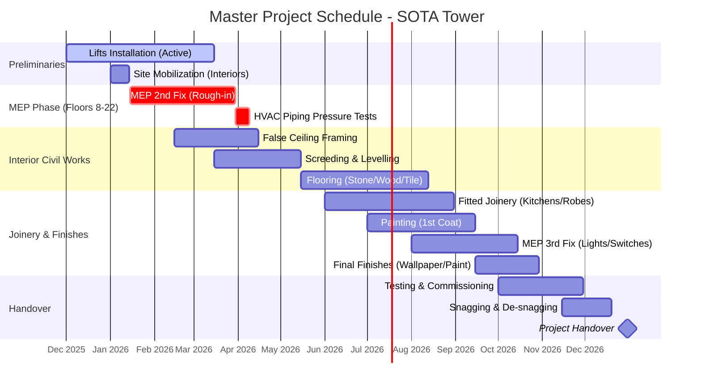
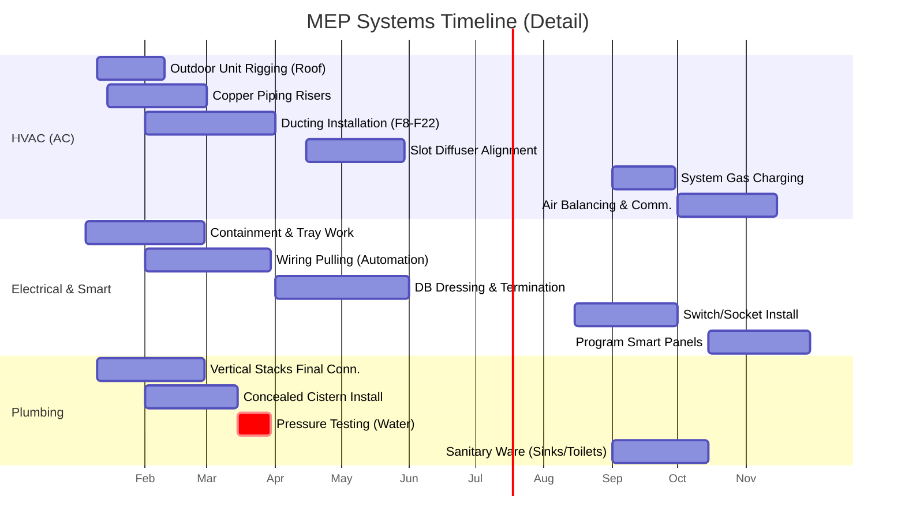
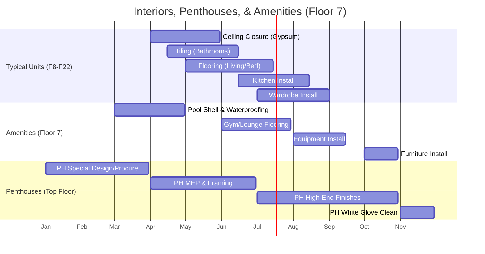

# Project Recovery Plan & Detailed Installation Timeline
**Project:** SOTA Residential Tower (Rhodium)
**Date:** December 25, 2025
**Target Completion:** December 2026

## 1. Project Overview & Architecture
**Structure:**
*   **Basement 1 & 2:** Parking, MEP Plant Rooms.
*   **Floors 1–6:** Residential Units (Studio, 1-Bed, 2-Bed).
*   **Floor 7:** Amenities/Recreation (Gym, Pool, Lounge).
*   **Floors 8–22:** Residential Units.
*   **Top Floor:** 2 Luxury Penthouses.

**Current Status (Baseline - Dec 2025):**
*   **Grey Structure:** 100% Complete.
*   **Exterior Finishing:** 100% Complete.
*   **Flooring:** Tile laying completed up to 6th Floor.
*   **Procurement:** All selections finalized & approved. Kitchens ordered.
*   **Active Works:** Lifts (In Progress), Door/Window frames (In Progress).

**Core Objective:**
Shift form procurement/structural focus to a strict, logistics-heavy **Installation & Commissioning** schedule to meet the December 2026 deadline (12 Months remaining).

---

## 2. The "SOTA" Granular Checklist (Installation Only)

### A. Information Technology & Smart Automation (Living/Dining/Bedrooms)
*   [ ] **Home Automation Panels:** Install & terminate CAT6/KNX control panels (e.g., Crestron/Control4/Lutron).
*   [ ] **Smart Curtains:** Install motorized curtain tracks (recessed in pelmets) and terminate power/data.
*   [ ] **Invisible Audio:** Install plaster-over wall speakers or ceiling speakers (Sonos/Bose) before final paint.
*   [ ] **Media Walls:** Install structural support for floating heavy-duty TV mounts.
*   [ ] **Climate Control:** Install linear slot diffusers (alignment with lighting plan is critical).
*   [ ] **WIFI Access Points:** Ceiling mount installation & PoE termination in central corridors/living areas.

### B. High-End Bathrooms
*   [ ] **Concealed Cisterns:** Final plumbing connection, pressure testing, and boxing-in (Geberit or similar).
*   [ ] **Niche Construction:** Waterproofing and tiling of shower niches with pre-wired LED strip channels.
*   [ ] **Rain Showers:** Ceiling mounting of flush rain-heads; check for level and equal pressure.
*   [ ] **Line Drains:** Installation of linear infinity drains; gradient verification.
*   [ ] **Vanity Lighting:** Installation of under-vanity LED motion sensors.
*   [ ] **Mirror Systems:** Install heated demister pads behind mirrors; clear silicone sealing.
*   [ ] **Glass Enclosures:** Floor-to-ceiling toughened glass installation; acoustic & water sealing.
*   [ ] **Stone Countertops:** Mitered edge alignment and sealing.

### C. Kitchens & Joinery
*   [ ] **Carcass Installation:** Leveling and fixing of kitchen cabinet carcasses.
*   [ ] **Island Installation:** Plumbing and electrical feed pull-throughs for islands.
*   [ ] **Stone Splashbacks:** Book-matched stone installation (measure twice, cut once).
*   [ ] **Appliance Integration:** Flush mounting of ovens/microwaves; clearance checks for ventilation.
*   [ ] **Under-Cabinet Lighting:** Routering channels for invisble LED strip installation.

### D. Bedrooms
*   [ ] **Wardrobe Assembly:** Internal carcass erection, installing soft-close drawer runners.
*   [ ] **Wardrobe Lighting:** Door-sensor activation switches and internal LED strips.
*   [ ] **Reading Lights:** Hardwiring of articulating bedside reading lamps.
*   [ ] **Acoustic Seals:** installation of drop-down acoustic seals on apartment entry doors.
*   [ ] **Headboard Panels:** Mounting of upholstered or veneer massive headboard panels.

### E. Common Areas & Amenities (Floor 7)
*   [ ] **Pool Equipment:** Sand filter installation, dosing pump calibration, heat pump syncing.
*   [ ] **Gym Flooring:** Impact acoustic underlay + rubberized high-performance flooring.
*   [ ] **Spa/Sauna:** Vapor barrier installation, cedar wood cladding, heater commissioning.
*   [ ] **Lounge:** Joinery for reception desk, feature lighting installation (chandeliers).

### F. Building Systems (MEP) & Basement
*   [ ] **HVAC Plant:** Outdoor VRF unit rigging (Roof/Mechanical floors), copper pipe vacuum testing.
*   [ ] **Generators:** ATS (Automatic Transfer Switch) syncing and load bank testing.
*   [ ] **Fire Alarm:** Smoke detector head installation, loop testing, interface with access control.
*   [ ] **Lifts:** Guide rail alignment, cabin assembly, call button wiring, safety gear testing.
*   [ ] **BMS:** Building Management System sensor calibration (CO2 sensors in parking, temp sensors in corridors).

---

## 3. Visual Project Timelines (Gantt Charts)

We have broken down the visualizations into three critical views:
1.  **Macro Timeline:** The high-level phasing for the entire building.
2.  **MEP Systems:** Detailed timeline for HVAC, Electrical, and Plumbing.
3.  **Interior Fit-out:** The aesthetic completion sequence.

### A. Macro Project Schedule (Jan - Dec 2026)
*Overview of the consolidated phases for the entire tower.*

### B. MEP Specific Timeline (HVAC, Electrical, Plumbing)
*Detailed breakdown of the crucial mechanical systems.*

### C. Interior Fit-Out & Amenities Timeline
*Sequence for aesthetics, amenities, and penthouses.*

---

## 4. Logic & Critical Dependencies (Rules of Engagement)

1.  **The "Dusty vs. Clean" Rule:**
    *   No "Clean" trades (Painting, Siliconing, Switch-plate install) allowed on a floor until "Dusty" trades (Tile cutting, Gypsum sanding) are 100% demobilized and vacuumed from that floor.

2.  **The Vertical Logistics Rule:**
    *   Lifts are priority for **Materials** up to 8AM-9AM.
    *   Lifts are priority for **Labor** 8AM-9AM.
    *   Trash removal occurs **Post-5PM** only to avoid clogging vertical transport during working hours.

3.  **MEP Sequencing:**
    *   Pressure tests (Water/Gas/Refrigerant) must be witnessed and signed off **BEFORE** any wall or ceiling is closed. No exceptions.
    *   Floor boxes requiring cut-outs must be defined **BEFORE** flooring starts.

4.  **Joinery Protection:**
    *   Kitchen stone benchtops installed immediately after cabinets.
    *   Once installed, ALL joinery must be wrapped in heavy-duty cardboard protection until Snagging Phase.
